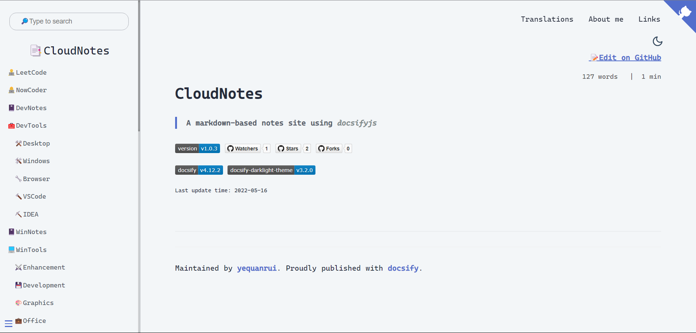

# CloudNotes

> A markdown-based notes site using _docsifyjs_

## 界面预览

## 文件作用

| 文件(docs/*)        | 作用                       |
| :------------------ | :------------------------- |
| index.html          | 基础配置项（入口）         |
| _index.md/README.md | 主页内容渲染文件           |
| _errorpage.md       | 404页面配置文件            |
| _coverpage.md       | 封面配置文件               |
| _navbar.md          | 导航栏配置文件             |
| _sidebar.md         | 侧边栏配置文件             |
| _footer.md          | 页脚配置文件               |
| favicon.ico         | 浏览器图标                 |
| .nojekyll           | 阻止忽略掉下划线开头的文件 |
