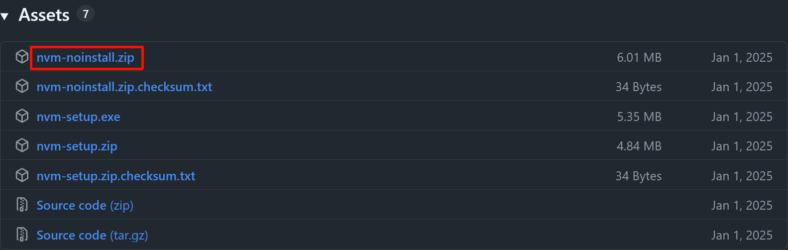
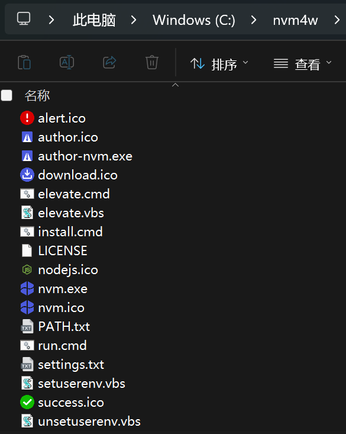
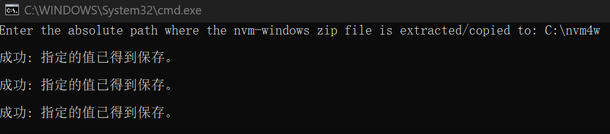
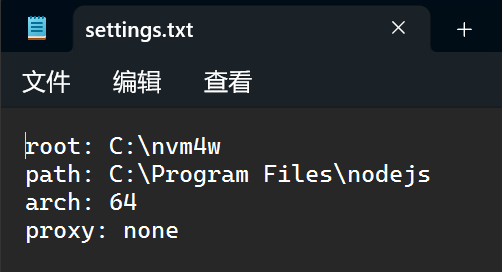
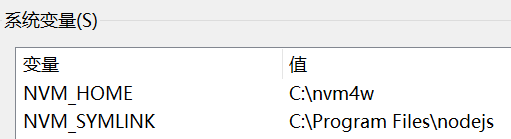
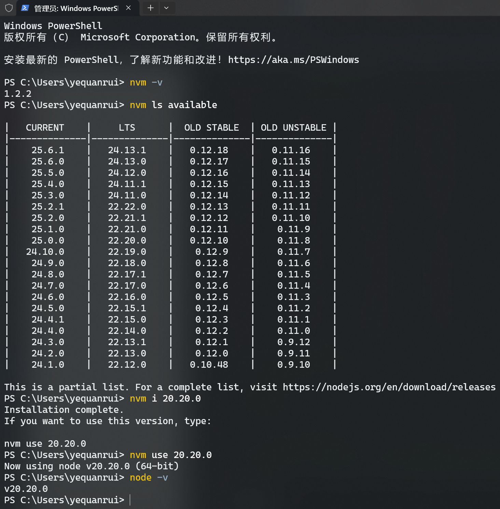

### 配置和使用nvm免安装版本(nvm-noinstall.zip)

> `NVM`全称为`Node Version Manager`（`Node.js`版本管理工具），是一个用于管理多个`Node.js`版本的工具。

1. 从[官方地址](https://github.com/coreybutler/nvm-windows/releases)下载最新版本NVM，一般安装最新版本即可
2. 解压下载的`nvm-noinstall.zip`文件到需要安装的目录（例如`C:\nvm4w`）
3. 右键以管理员身份运行`install.cmd`，输入当前目录（例如`C:\nvm4w`）即可进行安装
4. 安装完会打开的nvm配置文件`setting.txt`，可以根据需要进行修改
   - `root` nvm根目录，在执行完`nvm install`后会将nodejs安装到该目录下
   - `path` 当前nodejs所在目录，在执行完`nvm use`后会复制文件到该目录下
5. 安装完会产生两个环境变量`NVM_HOME`、`NVM_SYMLINK`，并且会自动添加到path中，只需查看一下其是否要与 `setting.txt`中的`root`和`path`值相对应，如果不同就要修改一下保持一致，避免后续使用出错
6. nvm基本操作如下
7. nvm所有命令行如下
   - `nvm arch`：显示node是运行在32位还是64位
   - `nvm install <version> [arch]`：安装node，`version`是特定版本也可以是最新稳定版本`latest`。可选参数`arch`指定安装32位还是64位版本，默认是系统位数。可以添加`--insecure`绕过远程服务器的SSL
   - `nvm list [available]`：显示已安装的列表。可选参数`available`，显示可安装的所有版本。`list`可简化为`ls`
   - `nvm ls`或`nvm list`：显示已安装的列表
   - `nvm on`：开启node.js版本管理
   - `nvm off`：关闭node.js版本管理
   - `nvm proxy [url]`：设置下载代理。不加可选参数url，显示当前代理。将url设置为none则移除代理。
   - `nvm node_mirror [url]`：设置node镜像（默认是 https://nodejs.org/dist/ ）。如果不写url，则使用默认url。设置后可至安装目录settings.txt文件查看，也可直接在该文件操作
   - `nvm npm_mirror [url]`：设置npm镜像（默认是 https://github.com/npm/cli/archive/ ）。如果不写url，则使用默认url。设置后可至安装目录settings.txt文件查看，也可直接在该文件操作
   - `nvm uninstall <version>`：卸载指定版本node
   - `nvm use [version] [arch]`：使用制定版本node。可指定32/64位
   - `nvm root [path]`：设置存储不同版本node的目录。如果未设置，默认使用当前目录
   - `nvm version`或`nvm v`或`nvm -v`：显示nvm版本。`version`可简化为`v`
