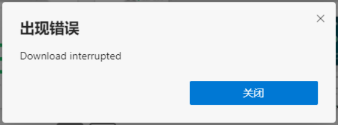
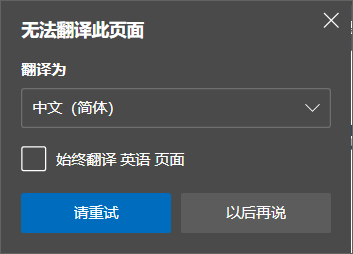
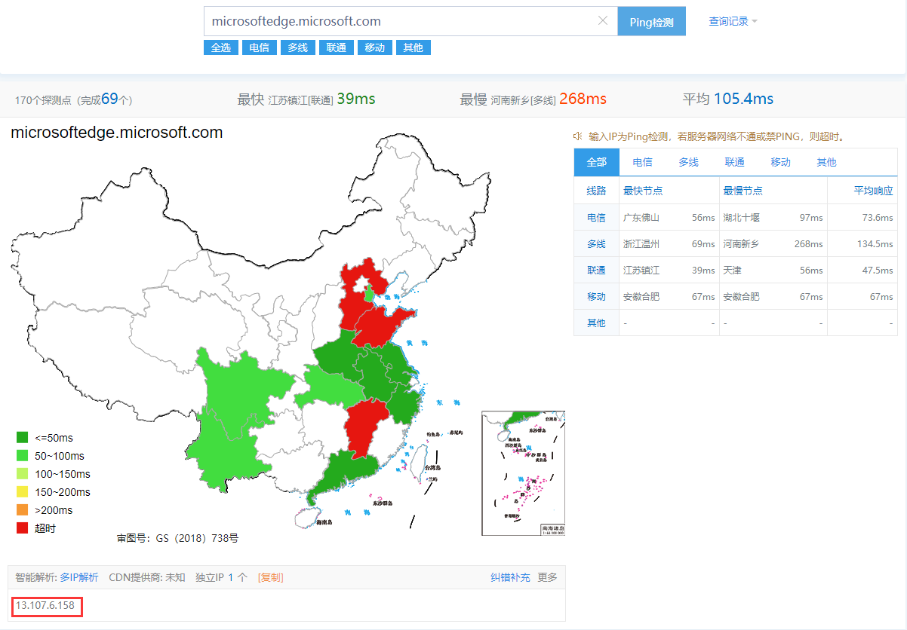

### 解决微软Edge安装插件出现错误，以及无法登录和翻译等问题

> 问题现象：
>
> 1. 安装插件出现错误
>
>     
>
> 2. 无法翻译此页面
>
>     

#### 使用管理员权限编辑host文件

1. 按住`Win+X`组合键或右击开始菜单，选择`Windows 终端（管理员）`
2. 输入`notepad C:\Windows\System32\drivers\etc\hosts`，回车
3. 在最下面添加如下配置：

    ```bash
      # 无法登录微软账号
      13.107.6.158 logincdn.msauth.net
      13.107.6.158 login.live.com
      13.107.6.158 account.live.com
      13.107.6.158 acctcdn.msauth.net
      # Edge无法翻译
      13.107.6.158 edge.microsoft.com
      # Edge无法安装扩展
      13.107.6.158 msedgeextensions.sf.tlu.dl.delivery.mp.microsoft.com
    ```

4. 回到Windows终端，输入`ipconfig /flushdns`，刷新DNS缓存

#### 如果上方配置的IP失效了，可以通过以下方法获取新IP

1. 浏览器访问`http://ping.chinaz.com/microsoftedge.microsoft.com`
2. 复制智能解析下的IP地址

    

3. 替换上方host配置里的IP
4. 刷新DNS缓存
